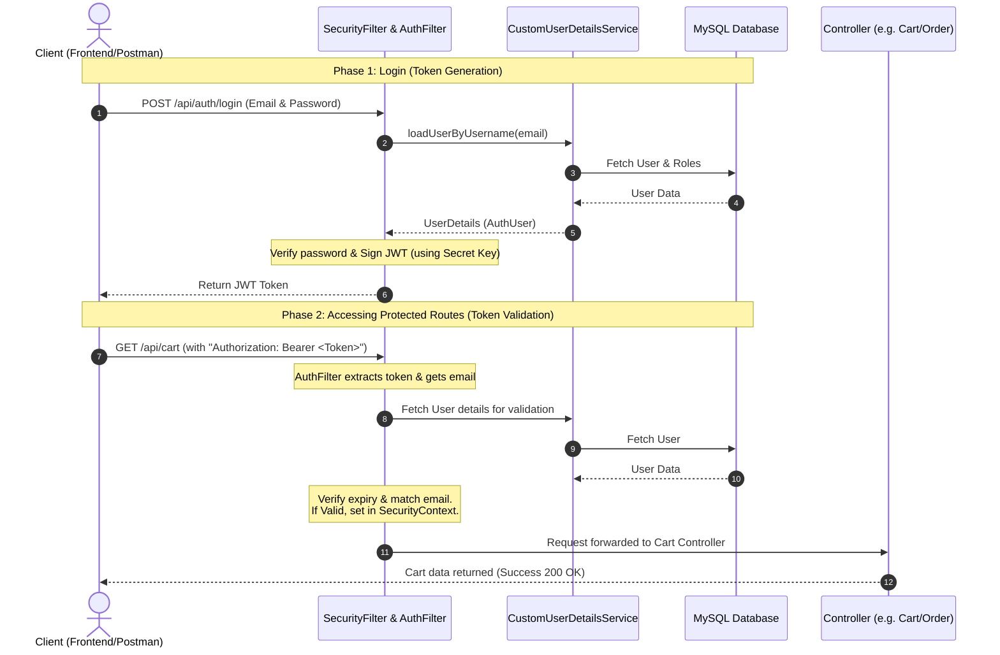

# Comprehensive Guide: JWT & Spring Security in Spring Boot
*Compiled Notes for Developer Interview & Project Reference (2-Year Experience Level)*

---

## 1. Core Concepts: Authentication & JWT

### Stateful vs. Stateless Authentication
| Feature | Stateful (Session-Based) | Stateless (JWT-Based) |
| :--- | :--- | :--- |
| **Storage** | Server memory (HttpSession) or Redis DB. | Client-side (Local Storage, Cookies). |
| **Scalability** | Harder. Multi-server environments need session sharing. | Extremely easy. Any server can decode/verify the token. |
| **Server Overhead** | High memory usage for active sessions. | Low. Server only performs CPU signature checks. |
| **Mobile Compatibility**| Hard. Native apps don't handle sessions/cookies well. | Native. Mobile apps send JWT in headers easily. |

### Why is JWT Secure?
A JWT consists of three parts separated by dots (`.`): **Header.Payload.Signature**
1. **Header**: Metadata about the token (e.g., Algorithm used like HS256).
2. **Payload**: Non-sensitive user details (Claims) like user email, creation time, and expiration date.
3. **Signature**: Created by combining **Header + Payload + Server's Private Secret Key** using a cryptographic algorithm. 
> [!IMPORTANT]
> If a client tries to modify the email in the payload to hack the application, the signature will mismatch. Since only the server knows the private secret key, the server detects tampering immediately and rejects the request.

---

## 2. Complete Architecture & Request Flow

This diagram illustrates the step-by-step lifecycle of both the **Login Phase** and the **Accessing Secure Endpoints Phase**.



---

## 3. Code Breakdown (Line-by-Line Execution)

### File A: [AuthFilter.java](file:///d:/PROJECTS/FoodApp%20(1)/FoodApp/src/main/java/com/phegon/FoodApp/security/AuthFilter.java)
Acts as a security interceptor for every single HTTP request.

```java
protected void doFilterInternal(HttpServletRequest request, HttpServletResponse response, FilterChain filterChain) 
    throws ServletException, IOException {

    // 1. Extract raw token string from the Authorization header (replaces "Bearer " prefix)
    String token = getTokenFromRequest(request);

    if(token != null) {
        String email;
        try {
            // 2. Decode the token to get the user email
            email = jwtUtils.getUsernameFromToken(token);
        } catch (Exception ex) {
            // If token is invalid/tampered, trigger entry point to return 401 Unauthorized
            AuthenticationException authenticationException = new BadCredentialsException(ex.getMessage());
            customAuthenticationEntryPoint.commence(request, response, authenticationException);
            return;
        }

        // 3. Load latest user status and roles from DB
        UserDetails userDetails = customUserDetailsService.loadUserByUsername(email);
        
        // 4. Validate token expiration and email matching
        if(StringUtils.hasText(email) && jwtUtils.isTokenValid(token, userDetails)) {
            // 5. Wrap user details into Spring Security's Authentication context card
            UsernamePasswordAuthenticationToken authenticationToken = 
                new UsernamePasswordAuthenticationToken(userDetails, null, userDetails.getAuthorities());
            authenticationToken.setDetails(new WebAuthenticationDetailsSource().buildDetails(request));
            
            // 6. Set user as Authenticated in Spring Security Context for current Thread
            SecurityContextHolder.getContext().setAuthentication(authenticationToken);
        }
    }

    // 7. Forward request to next filter in the chain (SecurityFilter)
    try {
        filterChain.doFilter(request, response);
    } catch (Exception e) {
        log.error(e.getMessage());
    }
}
```

---

### File B: [JwtUtils.java](file:///d:/PROJECTS/FoodApp%20(1)/FoodApp/src/main/java/com/phegon/FoodApp/security/JwtUtils.java)
Helper utility class containing core cryptographic functions.

* **Key Creation (`@PostConstruct`)**: 
  Converts the raw secret string into a secure cryptographic `SecretKeySpec` using the `HmacSHA256` algorithm.
* **Token Generation (`generateToken`)**:
  Builds a signed token with subject (user email), issue date, expiry date (30 days), and signs it using the generated key.
* **Claims Extraction (`extractClaims`)**:
  Parses the signed token using the key. If any part of the token has been edited by a hacker, it will throw a signature/parsing error here.
* **Token Validation (`isTokenValid`)**:
  Checks if the username extracted matches the database `userDetails` username and ensures `!isTokenExpired(...)`.

---

### File C: [CustomUserDetailsService.java](file:///d:/PROJECTS/FoodApp%20(1)/FoodApp/src/main/java/com/phegon/FoodApp/security/CustomUserDetailsService.java)
Connects your database to Spring Security.

```java
@Override
public UserDetails loadUserByUsername(String username) throws UsernameNotFoundException {
    User user = userRepository.findByEmail(username)
            .orElseThrow(()-> new NotFoundException("User Not Found!!!"));

    return AuthUser.builder().user(user).build();
}
```
* **Why**: Spring Security does not know your custom MySQL `User` entity structure.
* **What it does**: Fetches the user by email from the database and wraps it into a class that implements `UserDetails` ([AuthUser.java](file:///d:/PROJECTS/FoodApp%20(1)/FoodApp/src/main/java/com/phegon/FoodApp/security/AuthUser.java)).

---

### File D: [SecurityFilter.java](file:///d:/PROJECTS/FoodApp%20(1)/FoodApp/src/main/java/com/phegon/FoodApp/security/SecurityFilter.java)
Defines HTTP endpoint authorization rules.

* **Rules configuration**:
  ```java
  .authorizeHttpRequests(req -> req
      .requestMatchers("/api/auth/**", "/api/categories/**", "/api/menu/**", "/api/reviews/**").permitAll()
      .anyRequest().authenticated())
  ```
  * `/api/auth/**`, `/api/categories/**`, `/api/menu/**`, `/api/reviews/**` are **Public endpoints** (no token check required).
  * `.anyRequest().authenticated()` forces any other request (e.g. `/api/cart/**`) to have a valid authentication object inside `SecurityContextHolder`.
* **Session Policy**: Set to `STATELESS`. This forces Spring Security to clear the `SecurityContextHolder` after the HTTP response is sent back, ensuring no user state is preserved on the server.

> [!WARNING]
> **Code bug detected:** In `SecurityFilter.java`, the method `public SecurityFilterChain securityFilterChain(...)` is missing the `@Bean` annotation. You must add `@Bean` above it so Spring boot registers this security configuration.

---

## 4. Line-by-Line Scenarios

### Scenario 1: Initial Login Request (No Token)
* **Goal**: Request to `/api/auth/login`.
* **Step-by-step**:
  1. Request reaches `AuthFilter`.
  2. `getTokenFromRequest` returns `null` because no `Authorization` header is present.
  3. `if (token != null)` checks to `false` and skips the block.
  4. `filterChain.doFilter(request, response)` sends it to `SecurityFilter`.
  5. `SecurityFilter` matches URL with `/api/auth/**` which has `permitAll()`. Request passes.
  6. Controller handles login, validates password, calls `jwtUtils.generateToken(email)`, and returns the token to the client.

### Scenario 2: Requesting Secure Endpoint (With Token)
* **Goal**: Request to `/api/cart/add` with token `Bearer eyJhbG...`
* **Step-by-step**:
  1. Request reaches `AuthFilter`.
  2. `getTokenFromRequest` extracts the string `eyJhbG...`.
  3. `if (token != null)` is `true`.
  4. `jwtUtils.getUsernameFromToken` extracts the email `"user@example.com"`.
  5. `customUserDetailsService.loadUserByUsername` queries the DB to load the user profile.
  6. `jwtUtils.isTokenValid` checks if token is expired.
  7. A `UsernamePasswordAuthenticationToken` is created and stored in `SecurityContextHolder`.
  8. `filterChain.doFilter(...)` sends it to `SecurityFilter`.
  9. `SecurityFilter` sees the URL is `/api/cart/add` (requires authentication).
  10. Spring checks `SecurityContextHolder`, finds the authentication card, and allows the request.
  11. The request reaches `CartController`.
  12. **Response sent**: Spring clears the `SecurityContextHolder` (due to `STATELESS` session management).

---

## 5. Key Interview Q&A for 2-Year Developers

#### Q1: What is the purpose of `OncePerRequestFilter`?
**Answer:** It guarantees that the filter is executed exactly **once per HTTP request**. Standard Servlet filters can sometimes be executed multiple times during a single request (e.g., during internal forwards or error dispatches). 

#### Q2: What happens to the `SecurityContext` when a request finishes in a stateless application?
**Answer:** Because our session creation policy is set to `STATELESS`, the `SecurityContextHolder` (which uses `ThreadLocal` storage) is completely wiped out as soon as the HTTP response is dispatched back to the client. The server does not remember the user. The next request must send the token again.

#### Q3: How do you handle password encryption in Spring Boot?
**Answer:** We configure a `PasswordEncoder` bean (specifically `BCryptPasswordEncoder`) in our security config. When registering a user, we encrypt the password using `passwordEncoder.encode(rawPassword)` before saving it to the DB. During login, we use `authenticationManager` which matches the passwords internally.

#### Q4: What is the N+1 problem in JPA? How do you solve it?
**Answer:** The N+1 problem occurs when fetching an entity with lazy-loaded relationships. For example, loading N `User` entities, and then JPA running N additional separate queries to fetch the `Roles` of each user. It can be solved by using **JPQL Join Fetch** (`JOIN FETCH`) or **Entity Graphs** to load all relationships in a single database query.
